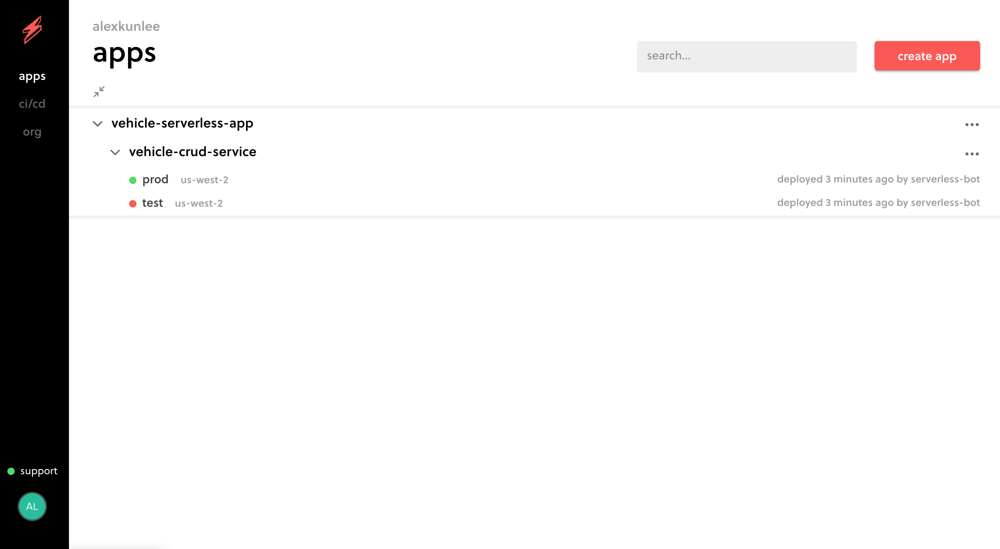
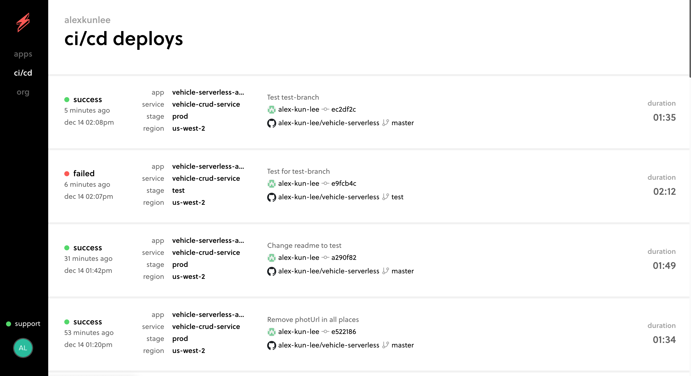
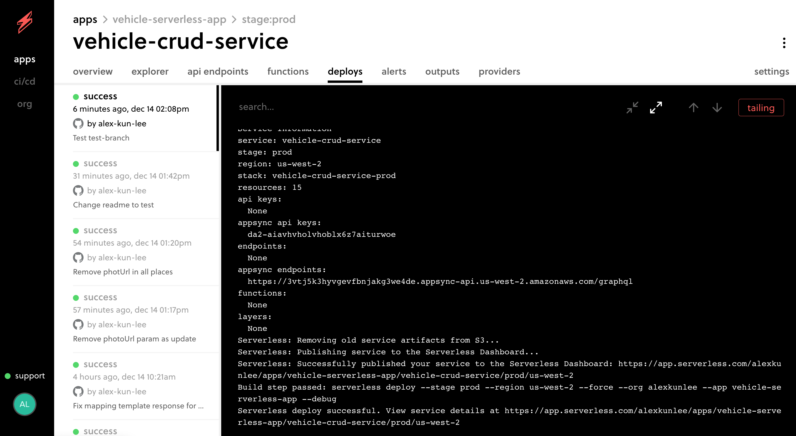

<h1>Serverless CRUD Project Test for real</h1>

  
  

## Introduction

As part of coding challenge for Serverless Guru, this project will feature CRUD operations using Serverless Framework and AWS Appsync

## Features

- Vehicle CRUD operations fully automated using IAC.
- Built using Serverless Framework to automatically deploy all AWS Infrastrcutures.
- Integration of AWS AppSync with Serverless Framework to enable GraphQL.
- Use of Serverless Pro CI/CD to trigger multi-stage branch deployment from Github.
- Use of ReactJS to display all vehicles using Apollo Client. [Repo Link](https://github.com/alex-kun-lee/vehicle-react-app)

## Screenshots of Severless Pro

## Author

👤 **Alex Lee**

* Github: [@alex-kun-lee](https://github.com/alex-kun-lee)